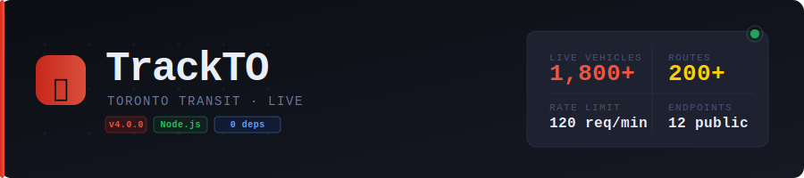

<div align="center">



**A real-time Toronto Transit Commission tracker with a public REST API.**  
Live vehicle positions, arrival predictions, service alerts, bunching detection, and trip planning — all from a single zero-dependency Node.js server.

[](https://nodejs.org)
[](package.json)
[](#rate-limiting)
[](LICENSE)

</div>

---

## Table of Contents

- [Features](#features)
- [Project Structure](#project-structure)
- [Getting Started](#getting-started)
- [API Reference](#api-reference)
  - [Vehicles](#vehicles)
  - [Routes](#routes)
  - [Arrivals](#arrivals)
  - [Stops](#stops)
  - [Alerts and Messages](#alerts-and-messages)
  - [Subway](#subway)
  - [Bunching](#bunching)
  - [Trip Planner](#trip-planner)
  - [Health and Docs](#health-and-docs)
- [Response Format](#response-format)
- [Rate Limiting](#rate-limiting)
- [Caching](#caching)
- [Environment Variables](#environment-variables)
- [Feature Ideas](#feature-ideas)
- [Deploying to GitHub](#deploying-to-github)

---

## Features

- 🚌 **Live vehicle map** — buses, streetcars, and subway trains updated every second
- 📍 **Arrival predictions** — real-time countdowns at any stop
- ⚠️ **Bunching detection** — flags vehicles within 400m on the same route
- 🚇 **Subway status** — per-line health for Lines 1–4
- 🗺️ **Trip planner** — find direct routes or 1-transfer options between stops
- 🔔 **Service alerts** — live disruptions and accessibility notices from TTC
- 🔍 **Stop search** — search by name or stop number, or find nearby stops by GPS
- 🛤️ **Vehicle trails** — position history for any tracked vehicle
- 🌙 **Dark mode** — full theme support
- 📱 **Mobile responsive** — bottom nav, full-screen map on small screens
- 🔌 **Public REST API** — 12 endpoints, rate-limited, no auth required

---

## Project Structure

```
trackto/
├── server.js          ← Node.js API server — all backend logic
├── package.json
├── .gitignore
├── README.md
├── banner.svg
└── public/
    ├── index.html     ← HTML structure — layout & elements only
    ├── styles.css     ← All CSS — edit this to change the look & feel
    └── app.js         ← All JavaScript — map, API calls, UI behaviour
```

**Want to edit the UI?**

| File | What to change |
|------|---------------|
| `public/styles.css` | Colors, spacing, fonts, dark mode, animations |
| `public/index.html` | Layout, add/remove panels, change header buttons |
| `public/app.js` | Map behaviour, data polling, UI logic |
| `server.js` | API endpoints, caching, rate limits, upstream sources |

---

## Getting Started

**Requirements:** Node.js 18+ — no `npm install` needed, zero dependencies.

```bash
git clone https://github.com/YOUR_USERNAME/trackto.git
cd trackto
node server.js
```

Then open:

- **Frontend** → http://localhost:3000
- **API Explorer** → http://localhost:3000/explorer
- **API Docs (JSON)** → http://localhost:3000/api/docs

---

## API Reference

All endpoints live under `/api/v1/`. Every response includes `"ok": true` on success or `"ok": false` with an error object on failure. See [Response Format](#response-format) for details.

---

### Vehicles

#### `GET /api/v1/vehicles`

Returns live vehicle positions for all active TTC vehicles. Supports **delta updates** — pass `?since=<timestamp>` to receive only vehicles that moved since that timestamp, dramatically reducing payload size for polling clients.

**Query parameters:**

| Parameter | Type | Required | Description |
|-----------|------|----------|-------------|
| `since` | number | No | Unix timestamp (ms). Returns only vehicles updated after this time. Omit or pass `0` for a full snapshot. |
| `route` | string | No | Filter by route tag (e.g. `501`). |

**Example requests:**
```
GET /api/v1/vehicles
GET /api/v1/vehicles?since=0
GET /api/v1/vehicles?since=1712345678000
GET /api/v1/vehicles?route=501
```

**Response fields:**

| Field | Type | Description |
|-------|------|-------------|
| `full` | boolean | `true` for a full snapshot, `false` for a delta |
| `total` | number | Total vehicle count (respecting route filter) |
| `vehicles` | array | Array of vehicle objects |
| `ts` | number | Server timestamp in ms — use as `since` on next poll |
| `umoTs` | number | Upstream UMO feed timestamp |

**Vehicle object:**

| Field | Type | Description |
|-------|------|-------------|
| `id` | string | Unique vehicle ID |
| `route` | string | Route tag (e.g. `"501"`, `"1"`) |
| `dir` | string | Direction tag |
| `lat` | number | Latitude |
| `lng` | number | Longitude |
| `hdg` | number | Heading in degrees (0–359) |
| `spd` | number | Speed in km/h |
| `age` | number | Seconds since last GPS report |
| `pred` | boolean | Whether predictions are available for this vehicle |

---

#### `GET /api/v1/vehicles/trail`

Returns the last 8 recorded positions for a specific vehicle, useful for rendering a movement trail.

**Query parameters:**

| Parameter | Type | Required | Description |
|-----------|------|----------|-------------|
| `id` | string | **Yes** | Vehicle ID from the `id` field in `/vehicles` |

**Example:**
```
GET /api/v1/vehicles/trail?id=4231
```

**Response:**

| Field | Type | Description |
|-------|------|-------------|
| `vehicle` | object | Current vehicle state |
| `trail` | array | Array of `[lat, lng, timestamp]` tuples, oldest first |

---

### Routes

#### `GET /api/v1/routes`

Returns all TTC routes. Cached for 1 hour.

**Response:**

| Field | Type | Description |
|-------|------|-------------|
| `count` | number | Total number of routes |
| `routes` | array | Array of `{ tag, title }` objects |

---

#### `GET /api/v1/route`

Returns full detail for a single route: stops, path geometry, directions, live vehicle count, and active bunching events. Cached for 1 hour.

**Query parameters:**

| Parameter | Type | Required | Description |
|-----------|------|----------|-------------|
| `tag` | string | **Yes** | Route tag (e.g. `501`, `1`, `25`) |

**Example:**
```
GET /api/v1/route?tag=501
```

**Response fields:**

| Field | Type | Description |
|-------|------|-------------|
| `tag` | string | Route tag |
| `title` | string | Route name (e.g. `"501 Queen"`) |
| `color` | string | Route colour as hex (e.g. `"#da291c"`) |
| `directions` | array | Directions the route runs. Each has `tag`, `title`, and `stops` (array of stop tags in order) |
| `stops` | array | All stops on the route. Each has `tag`, `title`, `stopId`, `lat`, `lng` |
| `paths` | array | Polyline paths for drawing the route on a map. Each path is an array of `[lat, lng]` pairs |
| `liveCount` | number | Number of vehicles currently active on this route |
| `bunching` | array | Active bunching events on this route |

---

### Arrivals

#### `GET /api/v1/arrivals`

Returns real-time arrival predictions at a stop. Optionally filter by route.

**Query parameters:**

| Parameter | Type | Required | Description |
|-----------|------|----------|-------------|
| `stop` | string | **Yes** | Stop tag or stop ID number |
| `route` | string | No | Route tag to filter predictions |

**Example:**
```
GET /api/v1/arrivals?stop=3318
GET /api/v1/arrivals?stop=3318&route=501
```

**Arrival object:**

| Field | Type | Description |
|-------|------|-------------|
| `route` | string | Route tag |
| `routeTitle` | string | Route name |
| `stop` | string | Stop tag |
| `stopTitle` | string | Stop name |
| `dir` | string | Direction label (e.g. `"Eastbound"`) |
| `dirTag` | string | Direction tag |
| `min` | number \| null | Minutes until arrival. `0` = arriving now. `null` if no prediction. |
| `sec` | number | Seconds until arrival (more precise than `min`) |
| `epoch` | number | Predicted arrival Unix timestamp in ms |
| `vehicle` | string | Vehicle ID making this prediction |
| `delayed` | boolean | Whether the vehicle is marked as delayed |
| `layover` | boolean | Whether affected by a layover |
| `msgs` | array | Service messages attached to this prediction |
| `noPred` | boolean | `true` if the direction exists but has no current predictions |

Results are sorted by `sec` ascending (soonest first).

---

### Stops

#### `GET /api/v1/stops/search`

Search stops by name or exact stop number.

> **Note:** Requires the stop index to be ready (~30 seconds after server start). Returns HTTP 503 until then.

**Query parameters:**

| Parameter | Type | Required | Description |
|-----------|------|----------|-------------|
| `q` | string | One of `q` or `id` | Partial name search (e.g. `spadina`, `king at`) |
| `id` | string | One of `q` or `id` | Exact stop number (e.g. `3318`) |
| `limit` | number | No | Max results. Default `20`, max `50`. |

**Example:**
```
GET /api/v1/stops/search?q=spadina
GET /api/v1/stops/search?id=3318
```

---

#### `GET /api/v1/stops/nearby`

Returns stops within a given radius of a coordinate, sorted by distance.

**Query parameters:**

| Parameter | Type | Required | Description |
|-----------|------|----------|-------------|
| `lat` | number | **Yes** | Latitude |
| `lng` | number | **Yes** | Longitude |
| `radius` | number | No | Search radius in metres. Default `500`. |
| `limit` | number | No | Max results. Default `20`, max `50`. |

**Example:**
```
GET /api/v1/stops/nearby?lat=43.6532&lng=-79.3832&radius=300
```

**Stop object** (returned by both stop endpoints):

| Field | Type | Description |
|-------|------|-------------|
| `tag` | string | Internal stop tag |
| `title` | string | Stop name |
| `stopId` | string | Public stop number (shown on signs) |
| `lat` | number | Latitude |
| `lng` | number | Longitude |
| `routes` | array | Route tags that serve this stop |
| `dist` | number | Distance in metres (only in `/stops/nearby`) |

---

### Alerts and Messages

#### `GET /api/v1/alerts`

Returns live service alerts from TTC. Cached for 90 seconds.

**Query parameters:**

| Parameter | Type | Required | Description |
|-----------|------|----------|-------------|
| `route` | string | No | Filter alerts to a specific route tag |

**Alert object:**

| Field | Type | Description |
|-------|------|-------------|
| `id` | string | Alert ID |
| `title` | string | Alert headline |
| `desc` | string | Full description |
| `routes` | array | Route tags affected |
| `type` | string | Route type (e.g. `"Bus"`, `"Subway"`) |
| `severity` | string | `"major"`, `"minor"`, or `"info"` |
| `effect` | string | Service effect description |
| `cause` | string | Cause description |
| `updated` | string \| null | Last updated timestamp |
| `url` | string \| null | Link to more information |

---

#### `GET /api/v1/messages`

Returns service messages for a route — usually driver notices or short-term service notes, distinct from formal alerts.

**Query parameters:**

| Parameter | Type | Required | Description |
|-----------|------|----------|-------------|
| `route` | string | No | Route tag to filter messages |

---

### Subway

#### `GET /api/v1/subway`

Returns a live summary of all four subway lines with vehicle counts, average speed, severity, and active alerts.

**Example response:**
```json
{
  "ok": true,
  "lines": [
    {
      "tag": "1",
      "name": "Yonge-University",
      "vehicles": 32,
      "avgSpd": 41,
      "severity": "ok",
      "alerts": []
    }
  ]
}
```

**Severity values:** `"ok"` · `"minor"` · `"major"` · `"info"`

---

### Bunching

#### `GET /api/v1/bunching`

Returns all vehicle bunching events — pairs of vehicles on the same route within 400m of each other. Computed in real-time from the current vehicle state.

**Query parameters:**

| Parameter | Type | Required | Description |
|-----------|------|----------|-------------|
| `route` | string | No | Filter to a specific route tag |

**Bunching event object:**

| Field | Type | Description |
|-------|------|-------------|
| `route` | string | Route tag |
| `vehicles` | array | The two bunched vehicle IDs |
| `dist` | number | Distance between them in metres |
| `lat` | number | Midpoint latitude |
| `lng` | number | Midpoint longitude |

---

### Trip Planner

#### `GET /api/v1/trip`

Finds routes connecting two stops. Returns direct routes (serving both stops) ordered by fewest stops between them, and up to 5 one-transfer options when no direct route exists.

**Query parameters:**

| Parameter | Type | Required | Description |
|-----------|------|----------|-------------|
| `from` | string | **Yes** | Origin stop tag or stop number |
| `to` | string | **Yes** | Destination stop tag or stop number |

**Example:**
```
GET /api/v1/trip?from=3318&to=3007
```

**Response:**

| Field | Type | Description |
|-------|------|-------------|
| `from` | object | Origin stop details |
| `to` | object | Destination stop details |
| `direct` | array | Direct route options, sorted by stop count |
| `transfers` | array | Transfer options (up to 5) when no direct route exists |
| `note` | string | Human-readable result summary |

**Direct route object:**

| Field | Type | Description |
|-------|------|-------------|
| `route` | string | Route tag |
| `routeTitle` | string | Route name |
| `direction` | string \| null | Best direction heading toward destination |
| `stops` | number \| null | Number of stops between origin and destination |
| `vehicles` | number | Live vehicle count on this route |

> Transfer results depend on route configs being cached. A fresh server instance may return incomplete suggestions for the first minute.

---

### Health and Docs

#### `GET /api/v1/health`

Returns server health, uptime, vehicle count, and stop index status. Useful for uptime monitoring.

```json
{
  "ok": true,
  "status": "ok",
  "version": "4.0.0",
  "uptime": 3724,
  "uptimeStr": "1h 2m",
  "vehicles": 1847,
  "stops": 12304,
  "stopIndexReady": true,
  "umoTs": 1712345678123,
  "ts": 1712345679000
}
```

#### `GET /api/docs`

Returns the full machine-readable API spec as JSON with endpoint descriptions, parameters, and live example URLs.

---

## Response Format

All endpoints return JSON with a consistent envelope.

**Success:**
```json
{
  "ok": true,
  "...endpoint-specific fields..."
}
```

**Error:**
```json
{
  "ok": false,
  "error": {
    "code": "MISSING_PARAM",
    "message": "?stop= required",
    "status": 400
  }
}
```

**Error codes:**

| Code | HTTP Status | Description |
|------|-------------|-------------|
| `MISSING_PARAM` | 400 | Required query parameter not provided |
| `NOT_FOUND` | 404 | Resource not found |
| `RATE_LIMITED` | 429 | Rate limit exceeded |
| `INDEX_BUILDING` | 503 | Stop index not yet ready (~30s after start) |
| `ERROR` | 500 | Internal server error |

---

## Rate Limiting

All `/api/*` requests are rate-limited per IP address.

- **120 requests per minute** by default
- Configurable via `RATE_LIMIT` environment variable
- Window resets every 60 seconds
- Stale IP entries are pruned every 5 minutes

**Response headers on every API request:**

| Header | Description |
|--------|-------------|
| `X-RateLimit-Limit` | Max requests per minute |
| `X-RateLimit-Remaining` | Requests left in the current window |
| `X-RateLimit-Reset` | Unix timestamp (seconds) when the window resets |

When exceeded, returns `429 Too Many Requests` with a message indicating when to retry.

---

## Caching

The server uses an in-memory cache to reduce upstream API load:

| Data | TTL | Notes |
|------|-----|-------|
| Route list | 1 hour | All routes from UMO |
| Route configs | 1 hour | Per-route stops, paths, and directions |
| Service alerts | 90 seconds | From TTC alerts API |
| Vehicle positions | — | Not cached — polled live every 1 second |

> Cache is in-memory only and resets on server restart. For multi-process or persistent deployments, consider adding a Redis layer.

---

## Environment Variables

| Variable | Default | Description |
|----------|---------|-------------|
| `PORT` | `3000` | HTTP server port |
| `RATE_LIMIT` | `120` | Max API requests per minute per IP |

---

## Feature Ideas

Potential additions worth considering:

| Feature | Difficulty | Notes |
|---------|------------|-------|
| **PWA / installable app** | Easy | Add `manifest.json` + service worker for home screen install |
| **Service status banner** | Easy | Surface major alerts prominently at the top of the sidebar |
| **API key auth** | Medium | `X-API-Key` header already declared in CORS — just needs validation logic in the router |
| **Redis caching** | Medium | Replace in-memory cache for multi-process or persistent deploys |
| **Historical headway charts** | Medium | Log vehicle spacing over time and render trends with Chart.js |
| **Accessibility stop filter** | Medium | Flag stops with active elevator outages from the accessibility alerts feed |
| **GTFS-RT feed** | Medium | Replace UMO with the official GTFS Realtime feed for richer, standardised data |
| **Isochrone map** | Hard | Highlight all stops reachable within N minutes from any point |
| **Route performance dashboard** | Hard | Track on-time performance and average speeds over time |
| **Push notifications** | Hard | Alert users when a saved route has a major service disruption |

---

## Deploying to GitHub

```bash
git init
git add .
git commit -m "Initial commit - TrackTO v4.0"
git remote add origin https://github.com/YOUR_USERNAME/trackto.git
git push -u origin main
```

To host the server, any Node.js platform works (Railway, Fly.io, Render, etc.). Set `PORT` from the environment — the frontend is served directly from the same process at `/`.

---

<div align="center">
  <sub>Data sourced from <a href="https://www.ttc.ca">TTC</a> via <a href="https://retro.umoiq.com">UMO IQ</a> and the <a href="https://alerts.ttc.ca">TTC Alerts API</a></sub>
</div>
